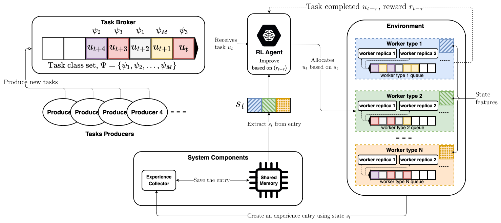

# RLQ Scheduler

RLQ: Workload allocation with reinforcement learning in distributed queues paper code

## Cite us

If you plan to use this code please cite us:

```bibtex
@ARTICLE{StaffolaniRLQ2023,
    author={Staffolani, Alessandro and Darvariu, Victor-Alexandru and Bellavista, Paolo and Musolesi, Mirco},
    journal={IEEE Transactions on Parallel and Distributed Systems}, 
    title={RLQ: Workload Allocation With Reinforcement Learning in Distributed Queues}, 
    year={2023},
    volume={34},
    number={3},
    pages={856-868},
    doi={10.1109/TPDS.2022.3231981}
}
```



## Deployment

### Requirements

- Python 3. We utilized python 3.8
- Kubernates cluster: used to deploy the system
 - A storage class provider. An Open-EBS configuration is provided in `kubernetes/open-ebs`.
 - Local access to the cluster via `kubectl` cli interface
- A Docker images registry. We utilized [Cloud Canister](https://cloud.canister.io/).
- An S3 object storage: used to save the results from training and evaluation. A MinIO deployment using docker is provided in `docker/minio`.
- MongoDB database: used to save run configuration and results summary. A deployment using docker is provided in `docker/mongo/docker-compose.yml`.

For our experiments we utilized Kubernates version `1.2`, Docker as Container Runtime Interface (CRI), Calico as Container Network Interface (CNI) and OpenEBS as a storage solution.

### Installing local packages

The `requirements` folder contains all the requirements for each component of the RLQ system. 
If you plan to run only the experiments on the Kubernates you need to install only the following requirements:

- `requirements/base.txt`
- `requirements/deployer_manager.txt`

Otherwise, if you plan to develop locally, you will need to install the requirements for all the components.

### Build and Publish docker images

Before deploying on Kubernates it is necessary to build and publish on the docker registry the images of the RLQ components.

The folder `scripts` contains several scripts to help with this process, before utilizing those scripts you need to create the `scripts/.env` file with the information to connect to the docker registry (a sample file is provided at `scripts/.env.sample`).

By lunching the `scripts/build-and-pull-all.sh` script all the required images will be built and published on the registry.

### Deploy

#### Prepare the deployment

In the `kubernetes/rlq` folder it is necessary to create the Kubernates secret deployments used inside the Kubernates deployment to interact with the MongoDB, the S3 and the Docker registry instances.
The folder already provides for the following sample files:

- `kubernetes/rlq/docker-secret.yaml.sample`: for the docker registry
- `kubernetes/rlq/minio-secret.yaml.sample`: for the S3 instance
- `kubernetes/rlq/mongo-secret.yaml.sample`: for the MongoDB instance

Additionally, the config files need to be changed accordingly to the available settings.

##### Deployer Manager Config

The deployer manager is responsible for deploying RLQ components on the Kubernates cluster accessible through `kubectl`. Its config are in the `config/deployer_manager.yml` file, where it is necessary to change the `custom_images` property to link to your images. Here the default one:

```yaml
custom_images:
  - cloud.canister.io:5000/rlq/agent
  - cloud.canister.io:5000/rlq/task_broker
  - cloud.canister.io:5000/rlq/task_generator
  - cloud.canister.io:5000/rlq/worker
  - cloud.canister.io:5000/rlq/trajectory_collector
  - cloud.canister.io:5000/rlq/system_manager
```

##### Global Config

The `config/global.yml` file contains a set of configuration available to all components. Unless you change some deployment file these configuration are ready to be used. Please note, here you can change the task classes and worker types configuration. 

For the task classes, under the `task_classes` property it is possible to define the property of a task class. Task classes are python functions defined in the `rlq_scheduler/tasks/tasks.py` file

For the worker types, under the `worker_classes` property it is possible to define the property of a worker type: its replicas, its resources and its costs

##### Run Config

The `config/run_config.yml` file contains an example of configuration of a single run of the system.

##### Multi Run Config

The `config/muti_run_config.yml` file allows to configure multiple runs using different parameters for both the agents and the overall system. This configuration is processed by the `SystemManager` in order to generate one `run_config` for each parameter provided in the config

##### Other Config Files

The `config` folder provides additional file configs, one for each component of the RLQ system


#### Start the deployer manager

The deployer manager handles the process of deploying all the RLQ components on the Kubernates cluster ready to start. In order to lunch it, run the following command:

```shell
python deploy.py deploy
```


If you changed any config path or other parameters you can see the full list of arguments of the script using the `-h` or `--help` arguments.

When you're done with the deployment you can remove it from Kubernates by executing: `python deploy.py cleanup`.

## Paper Results

The following provides a guide to reproduce the experiments we published in the "RLQ: Workload allocation with reinforcement learning in distributed queues" paper.

The experiments are composed of a training and evaluation phase. 
The training is required to obtain the initial knowledge for the RLQ-LinUCB and RLQ-DoubleDQN agents, while the evaluation is used to compare the performance of our proposed solutions against our baseline algorithms (for additional details about refer the actual paper). 
In particular, we have performed two main experiments:

1. Synthetic Workload Evaluation: we evaluated using synthetic workload generated by executing simple programs that stress different resources of the workers
2. Real-World Workload Evaluation: we evaluated using [Google Borg's traces from 2019](https://github.com/google/cluster-data/blob/master/ClusterData2019.md)

For both evaluations we have tested using three different reward functions: execution-time, execution-cost and waiting-time. 
In the following the procedure assume your Kubernetes cluster can host at least RLQ environment in parallel (in different namespaces). 
In this way it is possible to execute in parallel the experiments for the 3 reward functions.

### Synthetic Workload Training

The deployer manager script has a parameter to lunch multiple deploy in parallel. 
We use this parameter to create the three deployments that are configured in `kubernetes/evaluations` and `config/synthetic-evaluation` by running:

```shell
python deploy.py deploy --all --folder config/synthetic-evaluation
```

The `config/synthetic-evaluation` also contains the `multi_run_config.yml` used for each experiments.

Note: you might need to modify the `custom_images` property in the `deployer_manager.yml` files provided in the configuration folders.

### Real-World Workload Training

Similarly, to the Synthetic Workload Evaluation in `kubernetes/evaluations` and `config/real-world-evaluation` folders is configured RLQ system, thus run:

```shell
python deploy.py deploy --all --folder config/real-world-evaluation
```

Google traces are loaded by the docker images from the `data/google-traces` folder. However, the `google-traces` folder contains all the python scripts and pipeline used to extract those data. 
Please, refer to the `google-traces/README.md` documentation for additional details.

Note: you might need to modify the `custom_images` property in the `deployer_manager.yml` files provided in the configuration folders.

### Evaluation Experiments

The steps described so far allows to train the agents, for the final evaluation it is necessary to have a running deployment (see the steps above) and a `multi_run_config.yml` file with the path to the agents model to load. 
For simplicity, the `generate_eval_config.py` script can generate the config file. Before running it is necessary to change the following variables in the file:

```python
RESULT_FOLDER = 'waiting-time'
RESULT_FOLDER_OUTPUT = 'eval-waiting-time'

OUTPUT_FILES = 'config/evaluation/eval_config.yml'

MINIO_BUCKET = 'gtraces1'

AGENT_NAME = 'DoubleDQN'
AGENT_CODE = 'double-dqn'
AGENT_PARAM = ('lr', 'layers')

LOAD_SEEDS_FROM_DB = None  # or None
DB_NAME = 'sb_waiting_time'
DB_COLLECTION = 'waiting-time'

TASK_GENERATOR_SEED = 200
N_TASKS = 13730
N_BOOTSTRAP_TASKS = 0
REWARD_FUNCTION = 'waiting-time'
REWARD_FUNCTION_PARAMETERS = {}
LOAD_MODEL = False
TRAIN = True
ADD_BASELINES = False
```

### Evaluation Plots

The folder `notebooks` contains two jupyter notebook files with the code utilized to generate the plots in the paper. They can be utilize to reproduce the plots. It might be necessary to change the `RESULT_FOLDER` on the various blocks and to make it point to the `save_properties.run_name_prefix` property in the `multi_run_config.yml` used for the experiments